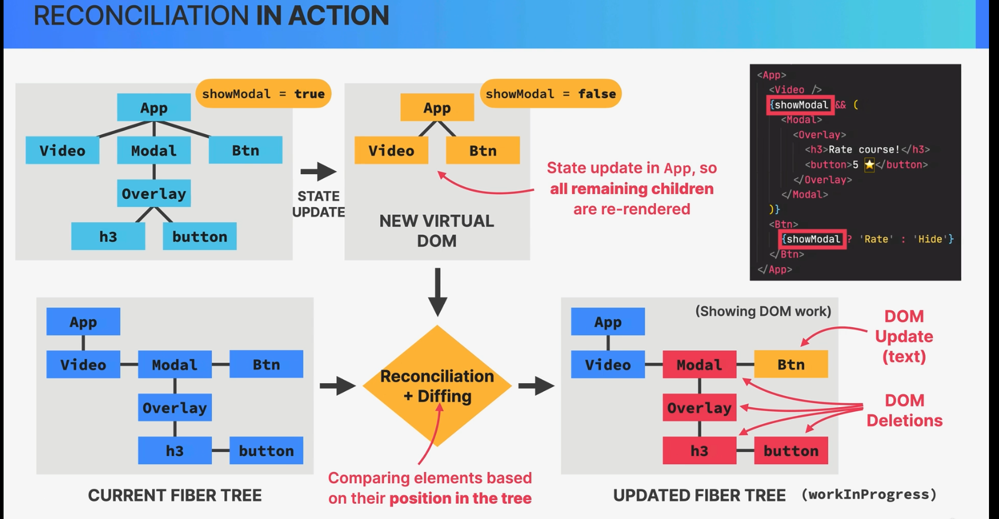

### Prop
- Props are read-only, they are immutable! this is one of React strict rules
- if you need to mutate prods you need to use state instead

- Mutationg props would affect patent creating side effects(not pure)
- Components have to be pure functions in terms of props and state
- This allows React to optimize apps avoid bugs, make apps predictable

### Component Categories
- Stateless Functional Components

- Stateful components

- Structural components
+ Pages, layouts, templates, etc, result  of composition
+ Can be huge and non-reusable

### Component composition
- combining different components using the children prop(or explicit defined props)

### Props type
- PropTypes
- we can specify the type of props that we are expecting

### how react work behind the scenes

#### understand conceptual difference between react components and component instance and dom elements
- React components are just functions or classes that return a React element
- component instance is the instance of this function or class component
- React element is a plain object that represents a DOM element or another component, and it's returned from the component function or class, it will convert to a DOM element and added to the DOM tree

#### concept of virtual DOM
- virtual DOM is a representation of the real DOM in the memory, it's a tree of React elements and components
- React uses virtual DOM to keep track of changes and sync the real DOM with the virtual DOM
- React uses a diffing algorithm to find the minimum number of changes in the DOM tree and then update the real DOM
 

### How components are displayed on the screen
- New render is triggered (By updating state somewhere) -> render phase (react calls component functions and figures out how DOM should be updated, actually it not update the DOM yet(rendering only happens internally inside react)) -> commit phase (react actually writes to DOM, updating inserting and deleting elements) -> Browser repaints to the screen

there are two ways to trigger renders
- 1 is veru first time the application runs(initial render)
- state update

So now we know that react looks at the entire tree whenever a render happens
- Renders are not triggered immediately, but scheduled for when the JS engine has some free time. there is also batchinh of multiple setState calls in event handlers

### review the mechanics of state in react
    
update state --> render/rerender --> (view)update the DOM(not true)

so how actually react update the DOM

Virtual DOM tree of all react elements created from all instances of the component tree
- Cheap and fast to create multiple trees, event if we need many iterations of it, because in the end it's just a js object

virtual dom is probable the most hype(virtual dom just the simple object)

Rendering a component will cause of its child compopnents to be rendered as well(no matter if props changed or not)
neccessary because react doesnt't know whether children will be affected(which is really not a big problem in small or medium sized applications)

### the render phase
Component instances that triggered re-render -> react elements -> new virtual DOM tree -> Reconciliation(Reconciler called fiber) + diffing <<<<<- current fiber tree before state update 
--> update fiber tree --> list of DOM update(still not update the DOM yet)

### what is reconciliation and why do we need it
why not update the entire DOM whenenere state changes somewhere in the app because that would be inefficient and wasteful:
- writing to the DOM is relatively slow
- Usually only a small part of the DOM needs to be updated
- React reuses as much of the existing DOM as possible, but how react knows which part of the DOM needs to be updated
Reconciliation: Deciding which DOM elements actually need to be inserted, deleted or updated, in order to reflect the latest state changes of the app

### The reconciler and the fiber tree
- Fiber takes the entire react element tree(so the virtual DOM and based on it) builds yet another tree which is the fiber tree 
fiber tree: internal tree that has a fiber for each component instance and DOM element

fibers are not recreated on every render, they are reused, they are just updated, it's mutable data structure

work can be done asynchronously
Rendering process can be split into chunks, tasks can be prioritized, and work can be paused, reused, or thrown away
that all this happens automatically behind the scenes
enables concurrent features like suspense or transitions
long renders won't block the main thread or js engine

### reconciliation in action

### The commit phase and browser paint

- Render Phase: list of doom updates(React lib does not touch the DOM, React only renders. it doesn't know where the render result will go, react can be used on different platforms, not just the browser) 

- Commit Phase: update the DOM(React write to the DOM; Insertions, Deletions, Updates. List of DOM updates are flushed to the DOM) (react DOM)
    + The commit phase is synchronous: DOM is updated in one go, it can't be interrupted. This is necessary so that the DOM never shows partial results, ensuring a consistent UI (in Sync with state all the time)

- After the commit phase, the workInProgress fiber tree becomes the current tree for next render cycle(fiber tree never recreate it reused) 

- Browser paints the screen: The browser paints the screen based on the updated DOM (Browser)

### how diffing works

- Diffing uses 2 fundamantal  assumptions(rules):
    + 1: Two elements of different types will produce different trees
    + 2: Elements with a stable key prop stay the same across renders
    (This allows react to go from 1,000,000,000 [O(n^3)] to 1000 [O(n)] operatins per 1000 elements)

1. Same position, different element
    - react assumes entire sub-tree is no longer valid
    - old components are destroyed and removed from DOM, including state
    - Tree might be rebuilt if children stayed the same (state is reset)
2. same position, same element
    - Element will be kepy (as well as child elements), including state
    - New props/attributes are passed if they changed between renders
    - Sometime this is not what we want... then we can use the key prop

### Key prop
- Special prop that we use to tell the diffing algorithm that an element os unique 
- Allows react to distinguish between multiple instances of the same component type
- When a key stays the same across renders, the element will be kept in the DOM (event if the position in the tree changes)
1 Using keys in lists

- When a key changes between renders, the element will be destroyed and a new one will be created (event if the position in the tree is the same as before)
2 Using keys to reset state