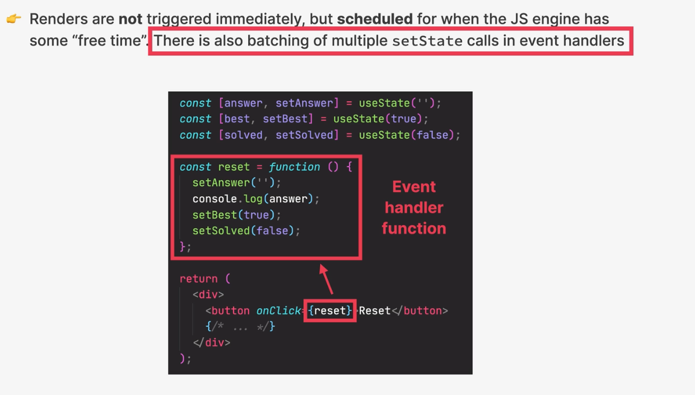
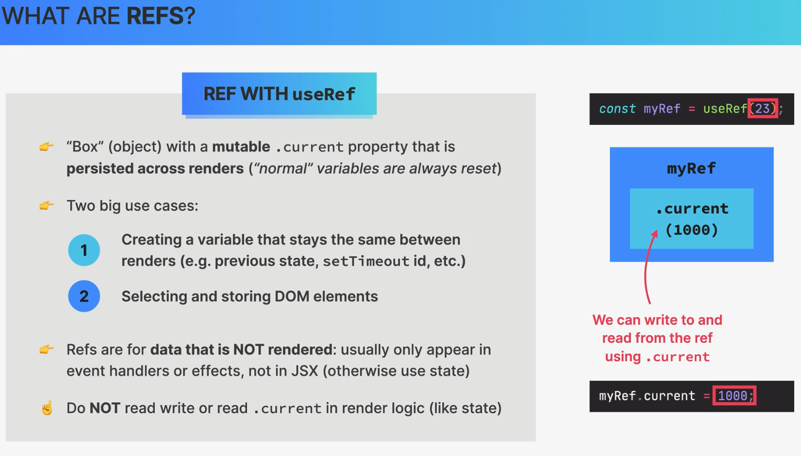

### Prop
- Props are read-only, they are immutable! this is one of React strict rules
- if you need to mutate prods you need to use state instead

- Mutationg props would affect patent creating side effects(not pure)
- Components have to be pure functions in terms of props and state
- This allows React to optimize apps avoid bugs, make apps predictable

### Component Categories
- Stateless Functional Components

- Stateful components

- Structural components
+ Pages, layouts, templates, etc, result  of composition
+ Can be huge and non-reusable

### Component composition
- combining different components using the children prop(or explicit defined props)

### Props type
- PropTypes
- we can specify the type of props that we are expecting

### how react work behind the scenes

#### understand conceptual difference between react components and component instance and dom elements
- React components are just functions or classes that return a React element
- component instance is the instance of this function or class component
- React element is a plain object that represents a DOM element or another component, and it's returned from the component function or class, it will convert to a DOM element and added to the DOM tree

#### concept of virtual DOM
- virtual DOM is a representation of the real DOM in the memory, it's a tree of React elements and components
- React uses virtual DOM to keep track of changes and sync the real DOM with the virtual DOM
- React uses a diffing algorithm to find the minimum number of changes in the DOM tree and then update the real DOM
 

### How components are displayed on the screen
- New render is triggered (By updating state somewhere) -> render phase (react calls component functions and figures out how DOM should be updated, actually it not update the DOM yet(rendering only happens internally inside react)) -> commit phase (react actually writes to DOM, updating inserting and deleting elements) -> Browser repaints to the screen

there are two ways to trigger renders
- 1 is veru first time the application runs(initial render)
- state update

So now we know that react looks at the entire tree whenever a render happens
- Renders are not triggered immediately, but scheduled for when the JS engine has some free time. there is also batchinh of multiple setState calls in event handlers

### review the mechanics of state in react
    
update state --> render/rerender --> (view)update the DOM(not true)

so how actually react update the DOM

Virtual DOM tree of all react elements created from all instances of the component tree
- Cheap and fast to create multiple trees, event if we need many iterations of it, because in the end it's just a js object

virtual dom is probable the most hype(virtual dom just the simple object)

Rendering a component will cause of its child compopnents to be rendered as well(no matter if props changed or not)
neccessary because react doesnt't know whether children will be affected(which is really not a big problem in small or medium sized applications)

### the render phase
Component instances that triggered re-render -> react elements -> new virtual DOM tree -> Reconciliation(Reconciler called fiber) + diffing <<<<<- current fiber tree before state update 
--> update fiber tree --> list of DOM update(still not update the DOM yet)

### what is reconciliation and why do we need it
why not update the entire DOM whenenere state changes somewhere in the app because that would be inefficient and wasteful:
- writing to the DOM is relatively slow
- Usually only a small part of the DOM needs to be updated
- React reuses as much of the existing DOM as possible, but how react knows which part of the DOM needs to be updated
Reconciliation: Deciding which DOM elements actually need to be inserted, deleted or updated, in order to reflect the latest state changes of the app

### The reconciler and the fiber tree
- Fiber takes the entire react element tree(so the virtual DOM and based on it) builds yet another tree which is the fiber tree 
fiber tree: internal tree that has a fiber for each component instance and DOM element

fibers are not recreated on every render, they are reused, they are just updated, it's mutable data structure

work can be done asynchronously
Rendering process can be split into chunks, tasks can be prioritized, and work can be paused, reused, or thrown away
that all this happens automatically behind the scenes
enables concurrent features like suspense or transitions
long renders won't block the main thread or js engine

### reconciliation in action

### The commit phase and browser paint

- Render Phase: list of doom updates(React lib does not touch the DOM, React only renders. it doesn't know where the render result will go, react can be used on different platforms, not just the browser) 

- Commit Phase: update the DOM(React write to the DOM; Insertions, Deletions, Updates. List of DOM updates are flushed to the DOM) (react DOM)
    + The commit phase is synchronous: DOM is updated in one go, it can't be interrupted. This is necessary so that the DOM never shows partial results, ensuring a consistent UI (in Sync with state all the time)

- After the commit phase, the workInProgress fiber tree becomes the current tree for next render cycle(fiber tree never recreate it reused) 

- Browser paints the screen: The browser paints the screen based on the updated DOM (Browser)

### how diffing works

- Diffing uses 2 fundamantal  assumptions(rules):
    + 1: Two elements of different types will produce different trees
    + 2: Elements with a stable key prop stay the same across renders
    (This allows react to go from 1,000,000,000 [O(n^3)] to 1000 [O(n)] operatins per 1000 elements)

1. Same position, different element
    - react assumes entire sub-tree is no longer valid
    - old components are destroyed and removed from DOM, including state
    - Tree might be rebuilt if children stayed the same (state is reset)
2. same position, same element
    - Element will be kepy (as well as child elements), including state
    - New props/attributes are passed if they changed between renders
    - Sometime this is not what we want... then we can use the key prop

### Key prop
- Special prop that we use to tell the diffing algorithm that an element os unique 
- Allows react to distinguish between multiple instances of the same component type
- When a key stays the same across renders, the element will be kept in the DOM (event if the position in the tree changes)
1 Using keys in lists

- When a key changes between renders, the element will be destroyed and a new one will be created (event if the position in the tree is the same as before)
2 Using keys to reset state

### The two types of logic in react components
1. Render logic
- Code that lives at the top level of the component function
- Participates in describing how the components view looks like
- Executed evert time the component renders

2. Event Handler Functions
- Executed as a consequence of the event that the handler is listening for (change event in this example)
- Code that actually does things: update state perform an http request, read an input field, navigate to another page, etc

### Refresher: functional programming principles

- Side effect: dependency on or modification of any data outside the function scope. "interaction with the outside world". Examples: mutating external variables, http requests, DOM queries, writing to the DOM, etc

- Pure function: function that does not have any side effects. It only depends on the input arguments and returns a value or another function. Examples: Math.max(), Math.min(), Math.sqrt(), etc
    + Does not changes any variables outside its scope
    + Given the same input, a pure function always returns the same output
    

- Side effects are not bad! A program can only be useful if it has some interaction with the outside world

### Rules for render logic
- Components must be pure when it comes to render logic: given the same props(input), a component instance should always return the same JSX(output)

Render logic must produce no side effects: no interaction with the outside world is allowed, so in render logic

    - Do not perform network requests (API calls)
    - Do not start timers
    - Do not directly use the DOM api
    - Do not mutate onjects or variables outside the function scope
    - Do not update state (or refs): this will create infinite loop

Side effects are allowed (and encouraged) in event handler functions
There is also a spcial hook to register side effects (useEffect)

### how state updates are batched
- Renders are not triggered immediately, but scheduled for when the JS engine has some free time. There is also batching of multiple setState calls in event handlers

### DOM refresher: event propagation and delegation

### Practical Summary
- A component is like a blueprint for a piece of UI that will eventually exist on the screen. When we "use" a component, React creates a component instance, which is like an actual physical manifestation of a component, containning props state, and more. A component instance, when rendered, wil return a React element

- "Rendering" only means calling component functions and calculating what DOM elements need to be inserted, deleted, or updated. is has nothing to do with writing to the dom. Therefore, each time a component instance is rendered and re-rendered, the function is called again

- only the initial app render and state updates can cause a render, which happens for the entire application, not just one single component

- When a component instance gets re-rendered, all its children will get re-rendered as well. this doesn't mean that all children will get updated in the DOM, Thanks to reconciliation, which checks which elements have actually changed between two renders, but all this re-rendering can still have an impact on performance( more on that later the course)

- Diffing is how react decides which DOM elements need to be added or modified. if, between renders, a certain react element stays at the same position in the element tree, the corresponding DOM  element and component state will stay the same. if the element changed to a different position, or if it;s a different element type, the DOM element and state will be destroyed

- Giving elements a key prop allows react to distinguish between mmultiple component instances. when a key stays the same across renders, the element is kept in the DOM, this is why we need to use keys in lists. when we change the key between renders, the dom element will be destroyed and rebuilt, we use this as a trick to reset state

- Never declare a new component inside another component! Doing so will re-create the nested component every time the parent component re-renders. react will always see the nested component as new, and therefore reset its state each time the parent state is updated. Instead, always declare components at the top level of the file, and then use them inside other components

- The login that produces JSX output for a component instance (render logic) is not allowed to produce and side effects: no api calls, no timers, no object or variable mutations, no state updates. Side effects are allowed is inside event handlers and inside useEffect

- The DOM is updated in the commit phase, but not by react, but by a "renderer" called ReactDOM. that's why we always need to include both libreries in a react web app project. we can use other renderers to use react on different platforms, for example to build mobile or native apps

- Multiple state updates inside an event handler function are batched, so they happen all at once, causing only one re-render, this means we can not access a state vatiable immediately after updating it: state updtes are asynchronous, Since react 18, batching also happens in timeouts, promises and native event handlers

- When using events in event handlers, we get access to a synthetic event object, not the browser's native object, so that events work the same way across all browsers. The difference is that most systhetic events bubble, including focus, blur, and change, which do not bubble as native browser events, only the scrool event does not bubble

- React is a library, not a framework. Thjis means that you can assemble your application using your favorite third-party libraries. the downside is that you need to find and lear all these additional libraries. no problem as you will learn about the most important use libraries in this course

### Summary useState!
[Alt text](
)
- make sure to not mutate objects or arrays, but to replace them with new ones

### useRef

